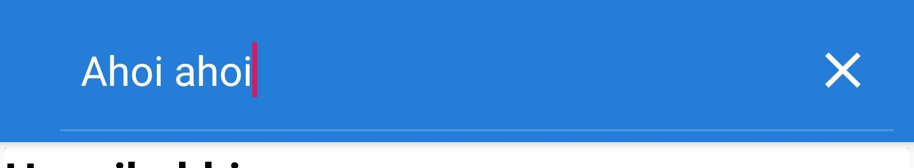
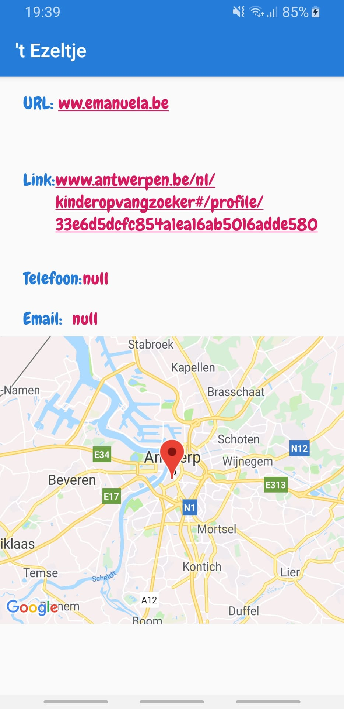
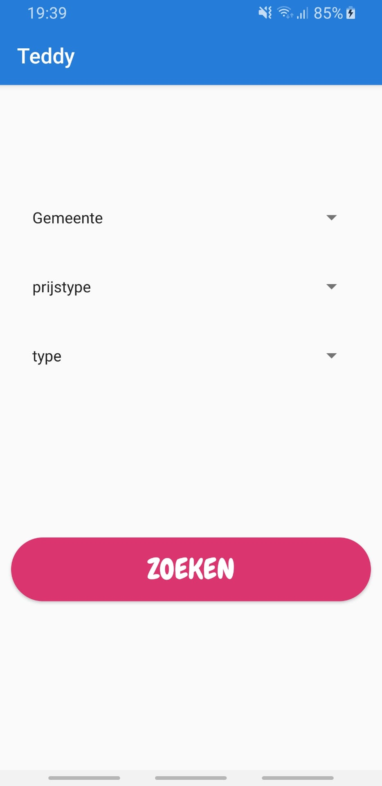

# Teddy
 herexamen androidstudio

Bij het openen van het app kom je op het startpagina terecht:  
  

Je ziet 2 knoppen die elk naar een andere pagina verwijzen.

Pagina kinderdagverblijven toont alle kinderdagverblijven in een recyclerview, alfabetisch gesorteerd op gemeente.  
  
Je hebt de mogelijkheid om te zoeken op naam. Helaas kon ik de gezochte items niet tonen in een recyclerview. 
Logcat toonde het gezochte resultaat wel. 
  
  

Na het klikken op het gewenste kinderdagverblijf, word je doorverwezen naar de detail pagina van het verblijf: 
  
Hier zie je een aantal gegevens van het verblijf. URL, Link en email velden kunnen soms null zijn omdat die velden online ook leeg zijn.
Als er een URL of Link aanwezig is kun je erop klikken en word je doorverwezen naar de pagina.
Onder de velden zie je een map met een marker die de x en y coordinaat van de verblijf bevat. Bij het klikken op de marker verschijnt er een optie die u de mogelijkheid geeft om er naartoe te navigeren of het op google maps te bekijken.  

Als je terug naar de startpagina gaat en op zoek op eigen maat klikt, word je doorverwezen naar een pagina waar je aan de hand van 3 belangrijke criteria's kunt zoeken naar een kinderdagverblijf. Na het klikken op zoeken word je doorverwezen naar een pagina dat de resultaten toont in een recyclerview. Nadien heb je weer de mogelijkheid om door te klikken waarna je naar de detailpagina doorverwezen word.  
  

