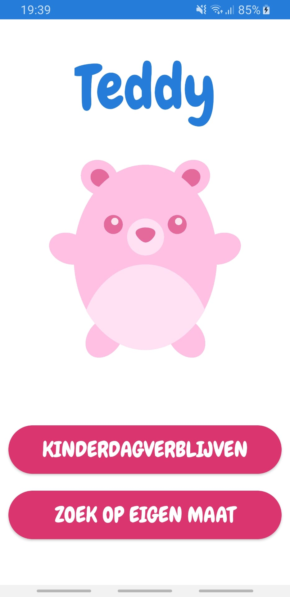
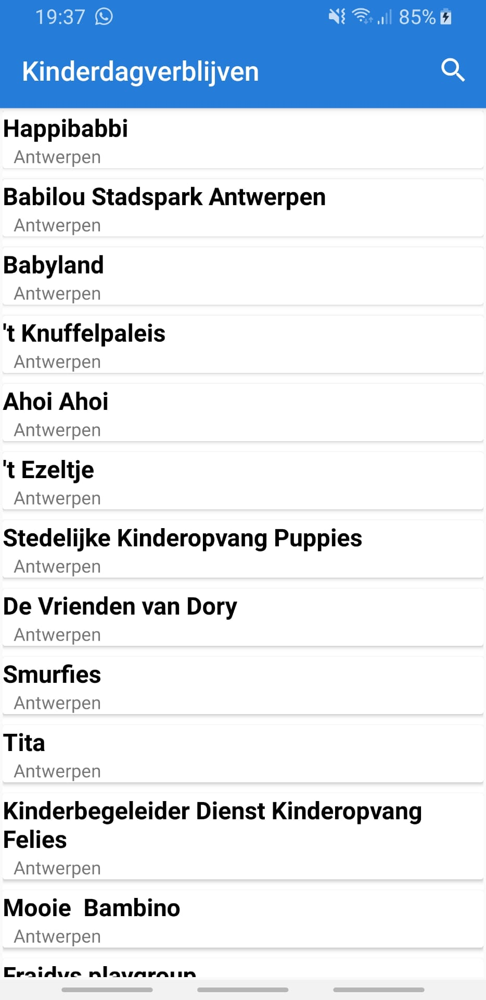
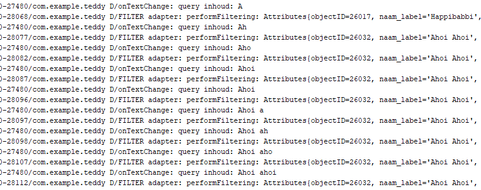

# Teddy
 herexamen androidstudio

Bij het openen van het app kom je op het startpagina terecht:  
  

Je ziet 2 knoppen die elk naar een andere pagina verwijzen.

Pagina kinderdagverblijven toont alle kinderdagverblijven in een recyclerview, alfabetisch gesorteerd op gemeente.  
  
Je hebt de mogelijkheid om te zoeken op naam. Helaas kon ik de gezochte items niet tonen in een recyclerview. In de Logcat toonde het gezochte resultaat wel.
  

